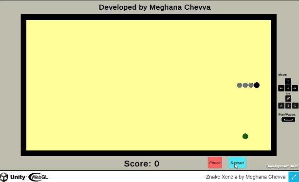
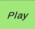
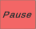
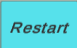
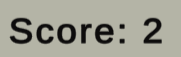
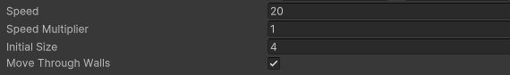

# ZnakeXenzia


This is a simple Snake game built with Unity. The game allows players to control a snake, collect food to grow longer. It features play, pause, and restart controls, and displays the score.

## Table of Contents

- [Features](#features)
- [Requirements](#requirements)
- [Installation](#installation)
- [Building](#building)
- [Usage](#usage)
- [Controls](#controls)
- [GameSettings](#gamesettings)
- [Contributions](#contributing)

## Features

- Control the snake using arrow keys or W, A, S, D.
- Grow the snake by eating food.
- Avoid/move through walls.
- Display the current score.
- Play, pause, and restart controls via buttons and the spacebar.

## Requirements

- Unity Hub
- Unity Editor 2022.3.23f1

## Installation

### Option 1: Clone Repository

1. **Clone the repository:**

    ```bash
    git clone https://github.com/meggitt/ZnakeXenzia.git
    cd ZnakeXenzia
    ```

2. **Open the project in Unity:**

    - Launch Unity Hub.
    - Click on `Add` and navigate to the cloned project folder.
    - Open the project.

### Option 2: Download Zip File

1. **Download Zip File:**

    - Go to the [project repository](https://github.com/meggitt/ZnakeXenzia).
    - Click on the green `Code` button.
    - Select `Download ZIP`.

2. **Extract Files:**

    - Extract the downloaded ZIP file to your desired location.

3. **Open the project in Unity:**

    - Launch Unity Hub.
    - Click on `Add` and navigate to the extracted project folder.
    - Open the project.

## Building


1. **Open Build Settings:**

    - In Unity, go to `File > Build Settings`.

2. **Select Platform:**

    - Choose your target platform (e.g., PC, Mac & Linux Standalone, WebGL).
    - For Linux builds, if unity isn't supporting to select build directory then use commands 
        - `path/to/unity_exe -quit -batchmode -projectPath /path/tp/project -buildLinux64Player /path/to/build_output_exe`
        - Go to build_output and run the build_output_exe file (`./game`)
    - Click `Switch Platform`.

3. **Build the Project:**

    - Click `Build`.
    - Choose a location to save the build files on your local PC.
    - Wait for the build process to complete.

## Usage

### Play, Pause, and Restart Buttons

- : Starts or resumes the game.
- : Pauses the game.
- : Restarts the game from the beginning.

### Score Display

- The score is displayed at the bottom of the game screen.



## Controls

- **Arrow Keys / W, A, S, D**: Move the snake.
- **Spacebar**: Toggle between play and pause.
- **Mouse**: Click on Play, Pause, and Restart buttons.

## GameSettings

- **Speed**: Initial value is 20.
- **Speed Multiplier**: Initially increases the speed by 1f.
- **InitialSize**: Initial size is 4.
- **Move Through Walls**: If checked allows snake to move through walls, if unchecked game will reset everytime snake hits/moves through walls.

## Contributions

Contributions are welcome! Please create an issue or submit a pull request with your changes.
